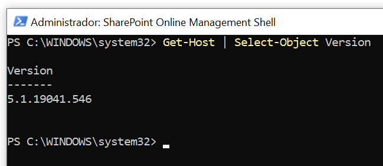
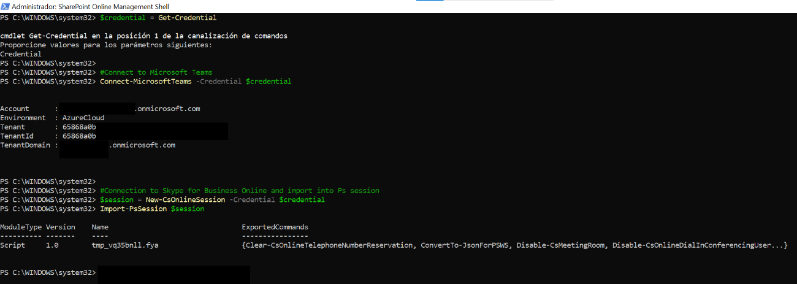
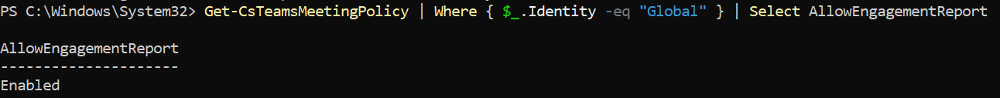
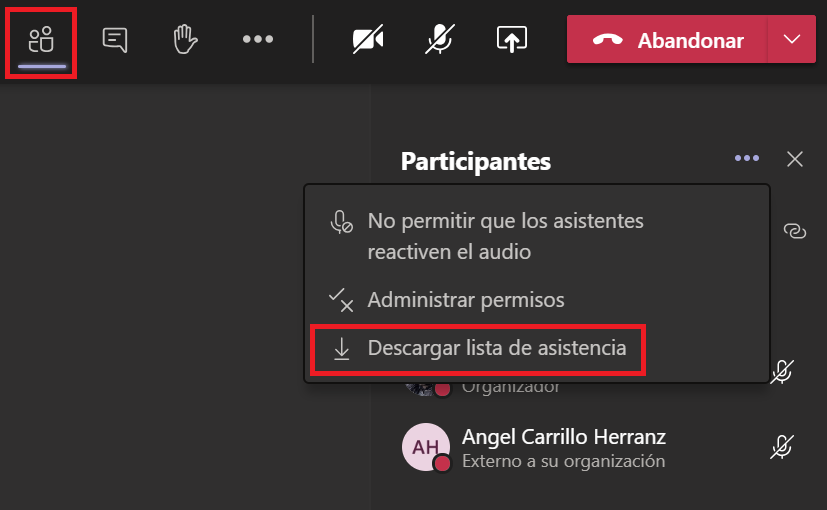
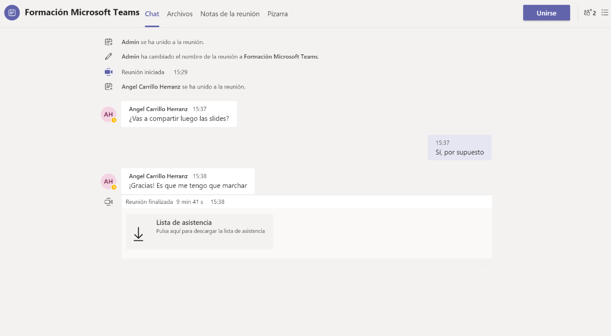

# TeamsEngagementReport

## Introducción

Este script sirve para habilitar el informe de asistentes de reuniones en Microsoft Teams.

Puedes ver la información completa en el blog de The Remote Company: [¡Por fin! Informe de asistencia a reuniones en Teams y cómo activarlo](https://theremotecompany.raona.com/comunicacion-y-colaboracion/por-fin-informe-de-asistencia-a-reuniones-en-teams-como-activarlo/).

## Instrucciones

El comando a utilizar es sencillo:

```powershell
Set-CsTeamsMeetingPolicy -Identity Global -AllowEngagementReport "Enabled"
```

Sin embargo, requiere tener instalado el módulo de SkypeOnlineConnector, por lo que si tu administrador no lo tiene habilitado, os dejamos los pasos para hacerlo:

### Paso 1: Descargar e instalar el módulo de Skype for Business Online
Para ello hay que visitar el centro de descargas de Microsoft a través del [siguiente enlace](https://www.microsoft.com/download/details.aspx?id=39366) y descargarse el módulo “SkypeOnlinePowerShell.exe”.

Una vez lo tengamos descargado lo instalaremos (siguiente, siguiente, siguiente…). El programa de instalación copia el módulo del conector de Skype Empresarial Online (y el cmdlet `New-CsOnlineSession`) en el equipo. Para acceder al módulo, inicia una sesión de PowerShell con credenciales de administrador y, a continuación, ejecuta el siguiente comando:

```powershell
Import-Module "C:\Program Files\Common Files\Skype for Business Online\Modules\SkypeOnlineConnector\SkypeOnlineConnector.psd1"
```

**NOTA:** Si no quieres escribir este comando cada vez que inicias PowerShell, puedes agregar el comando a tu perfil de PowerShell. Para ello, escribe el siguiente comando:

```powershell
notepad.exe $profile
```

Cuando aparezca el bloc de notas, agrega la línea siguiente en la parte inferior de los comandos que ya están en el perfil (si hay alguno):

```powershell
Import-Module SkypeOnlineConnector
```

### Paso 2: Descargar e instalar Windows PowerShell 5.1
Este paso normalmente no hay que hacerlo si está usando la actualización de aniversario de Windows 10 o Windows Server 2016, ya tiene Windows PowerShell 5.1. Para comprobarlo, tan sólo hay que ejecutar el comando:

```powershell
Get-Host | Select-Object Version
```



En el caso de no tener la versión 5.1 habrá que [descargarlo e instalarlo desde el centro de descargas de Microsoft](https://www.microsoft.com/download/details.aspx?id=54616).

### Paso 3: Iniciar sesión para trabajar con Teams PowerShell

Para ello, sólo habrá que abrir PowerShell como administrador e iniciar sesión con las credenciales de Azure:

```powershell
$credential = Get-Credential

#Connect to Microsoft Teams
Connect-MicrosoftTeams -Credential $credential

#Connection to Skype for Business Online and import into Ps session
$session = New-CsOnlineSession -Credential $credential 
Import-PsSession $session
```



### Paso 4: Habilita los informes
Tan sólo lanzar el comando descrito al inicio:

```powershell
Set-CsTeamsMeetingPolicy -Identity Global -AllowEngagementReport "Enabled"
```

Una vez lo hayamos hecho podemos ver nuestra política habilitada con el comando:

```powershell
Get-CsTeamsMeetingPolicy | Where { $_.Identity -eq "Global" } | Select AllowEngagementReport
```



Y podremos disfrutar de nuestros informes durante y después de nuestras reuniones de Teams.



